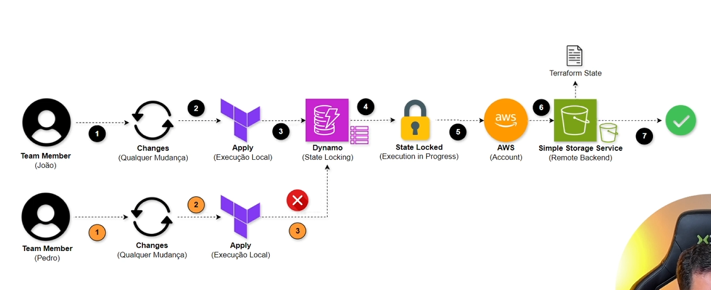

# 🏗️ Terraform AWS Infrastructure – Mini DevOps Course

This project demonstrates how to provision AWS infrastructure using Terraform. It includes the creation of SQS queues, a remote backend setup with S3 and DynamoDB, and uses best practices like variable abstraction and IAM role assumption.

## 📁 Project Structure

The project is organized into two main directories:

- `main-stack`: Responsible for main infrastructure components like SQS queues.
- `remote-backend-stack`: Sets up the remote state backend (S3 + DynamoDB).



---

## ⚙️ Prerequisites

Before running this project, make sure you have:

- ✅ [Terraform CLI installed](https://developer.hashicorp.com/terraform/tutorials/aws-get-started/install-cli)
- ✅ [AWS CLI installed](https://docs.aws.amazon.com/cli/latest/userguide/getting-started-install.html)
- ✅ Created an IAM Role in AWS Console with `AdministratorAccess` policy:
  - This role allows Terraform to authenticate via `assume_role` without hardcoding access keys.
  - See: [Terraform AWS Provider – Assuming an IAM Role](https://registry.terraform.io/providers/hashicorp/aws/5.99.0/docs#assume-role)
  - Create Role: [AWS IAM Console](https://us-east-1.console.aws.amazon.com/iam/home?region=us-east-1#/roles/create)

---

## 🚀 How to Run

1. **Configure your AWS credentials** with `aws configure` or use a named profile that can assume the role defined in `variables.tf`.

2. **Initialize and apply Terraform**:

```bash
cd remote-backend-stack
terraform init
terraform apply

cd ../main-stack
terraform init
terraform apply
```

---

## 🧰 Useful Commands

| Command               | Description                              |
|----------------------|------------------------------------------|
| `terraform init`     | Initialize Terraform working directory   |
| `terraform plan`     | Preview infrastructure changes           |
| `terraform fmt`      | Format Terraform configuration files     |
| `terraform validate` | Validate Terraform configuration         |
| `terraform apply`    | Apply the changes to AWS infrastructure  |

---

## 📦 Resources Created

### `main-stack`

- **SQS Queues** with multiple configurations:
  - `terraform-example-queue-01`
  - `terraform-example-queue-02`
- Example output (`outputs.tf`):
```hcl
output "sqs_queue_urls" {
  value = aws_sqs_queue.this[*].id
}
```

### `remote-backend-stack`

- **S3 Bucket** to store the `terraform.tfstate`
- **DynamoDB Table** to lock the state file
- Example backend configuration:
```hcl
terraform {
  backend "s3" {
    bucket         = "mini-aws-devops-course-remote-backend"
    key            = "main-stack/terraform.tfstate"
    region         = "us-east-1"
    dynamodb_table = "mini-aws-devops-course-remote-backend-locks"
  }
}
```

---

## 🔗 Useful Links

- 📘 [Terraform AWS Provider Docs (v5.99.0)](https://registry.terraform.io/providers/hashicorp/aws/5.99.0/docs)
- 🔍 [Terraform Provider Registry](https://registry.terraform.io/browse/providers)
- 📚 [Terraform Best Practices](https://www.terraform-best-practices.com/)
- ☁️ [Remote Backend Documentation](https://developer.hashicorp.com/terraform/language/backend/remote)
- 🪣 [AWS S3 Bucket Resource](https://registry.terraform.io/providers/hashicorp/aws/5.99.0/docs/resources/s3_bucket)
- 📨 [AWS SQS Console](https://us-east-1.console.aws.amazon.com/sqs/v3/home?region=us-east-1#/queues)

---

## ✍️ Final Notes

This project was built for learning purposes as part of a mini DevOps course. It is organized for clarity, modularity, and reuse across different environments. Feel free to adapt and expand it as you progress with Terraform and AWS.
